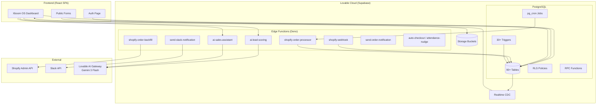

# Xboom Workflow — Technical Architecture & Operations Reference

> **Purpose**: This document is written for technical architects evaluating AI integration opportunities. It provides detailed operational, architectural, and data-level clarity into the Xboom Workflow platform.

---

## 1. Project Overview

### What is Xboom Workflow?

Xboom Workflow (internally "Xboom OS") is a custom-built internal operations platform for a B2B robotics and drone equipment company. It manages the full operational lifecycle: lead capture → quotation → order → procurement → delivery → invoicing → post-sale support.

### Core Business Model

- **Primary**: B2B sales of drones, robotics, safety devices, and related equipment to enterprises, government agencies, and institutional buyers.
- **Secondary**: Buyback/resale of used drones, drone repair services (B2C-facing public enquiry form).
- **Revenue streams**: Hardware sales (consumer drones, enterprise drones, agriculture drones, security devices, robotics kits), repair services, training programs, buyback-resale arbitrage.

### Primary Users

| Role | Description | Count Limit |
|------|-------------|-------------|
| **Admin** | Full system access, user approvals, org settings | Max 5 |
| **Sales** | Lead management, enquiries, pipeline, quotations, meetings | Unlimited |
| **Supply Chain** | Procurement, supplier management, inventory, imports | Unlimited |
| **Finance** | Invoicing, expenses, payments, petty cash, expected payments | Unlimited |
| **HR** | Attendance, leave, KPIs, documents, assets, candidates | Unlimited |
| **IT** | Internal tickets, system support | Unlimited |
| **Marketing** | Limited access, content/campaign coordination | Unlimited |

Users can hold multiple roles simultaneously. A role priority hierarchy (`Admin > HR > Finance > Supply Chain > IT > Marketing > Sales`) determines the primary role for UI rendering and navigation visibility.

External users interact only via:
- Public drone repair enquiry form (`/public/drone-repair-enquiry`)
- Embeddable custom forms (`/form-embed/:formId`)

---

## 2. System Architecture

### Frontend Stack

| Component | Technology | Version |
|-----------|------------|---------|
| Framework | React (SPA) | 18.3.x |
| Build tool | Vite | Latest |
| Language | TypeScript | Strict mode |
| Styling | Tailwind CSS + shadcn/ui | Latest |
| State management | TanStack React Query | 5.x |
| Routing | React Router DOM | 6.x |
| Charts | Recharts | 2.x |
| PDF generation | jsPDF + jspdf-autotable | 4.x / 5.x |
| Drag & Drop | @dnd-kit | 6.x |
| Spreadsheet export | xlsx (SheetJS) | 0.18.x |
| QR Code | qrcode.react | 4.x |

### Backend Stack

| Component | Technology |
|-----------|------------|
| Platform | Lovable Cloud (Supabase-managed) |
| Database | PostgreSQL 15+ |
| Auth | Supabase Auth (email/password, JWT) |
| Edge Functions | Deno (TypeScript) — deployed automatically |
| File Storage | Supabase Storage (private buckets with RLS) |
| Realtime | Supabase Realtime (PostgreSQL CDC) |
| Scheduled Jobs | pg_cron (database-level) |
| HTTP from DB | pg_net extension |

### Database Overview

**90+ tables** across these domains:

| Domain | Key Tables |
|--------|------------|
| Auth & Users | `profiles`, `user_roles`, `user_invitations`, `admin_whitelist` |
| Sales & Leads | `enquiries`, `enquiry_items`, `enquiry_tags`, `pipeline_orders`, `pipeline_tags`, `lead_tags` |
| Orders | `orders`, `order_items`, `order_procurement_links` |
| Procurement | `inventory_procurements`, `procurement_payment_requests`, `supplier_quotations` |
| Inventory | `inventory`, `inventory_transactions` |
| Suppliers | `suppliers`, `supplier_ratings`, `supplier_payments` |
| Billing | `quotes`, `quote_items`, `invoices`, `invoice_items`, `invoice_payments`, `invoice_audit_logs` |
| Finance | `expenses`, `expense_order_links`, `expense_procurement_links`, `expected_payments`, `petty_cash_transactions`, `payment_records` |
| HR | `employees`, `attendance_logs`, `attendance_breaks`, `attendance_audit_log`, `attendance_policy_settings`, `leave_requests`, `employee_kpis`, `employee_kpi_progress`, `employee_assets`, `employee_roles_responsibilities` |
| Candidates | `candidates`, `candidate_documents`, `interview_records` |
| Documents | `hr_documents`, `hr_folders`, `hr_document_shares`, `hr_folder_shares` |
| Tasks | `tasks` (auto-generated from enquiries, meetings, hot leads) |
| Meetings | `meetings` |
| Tickets | `tickets`, `ticket_comments` |
| Trainings | `trainings` |
| Repairs | `repairs`, `drone_repair_enquiries` |
| Buyback | `buyback_drones` |
| Forms | `forms`, `form_fields`, `form_submissions`, `form_views`, `form_permissions` |
| Notifications | `notifications`, `notices`, `notice_reads` |
| Shopify | `shopify_orders`, `shopify_orders_raw` |
| Imports | `imports`, `import_items` |
| Gamification | `sales_points`, `sales_targets`, `sales_daily_activities`, `sales_faqs`, `sales_suggestions`, `customer_testimonials` |
| Audit | `edit_history`, `user_activity_logs`, `attendance_notifications_log`, `nudge_health_log` |
| Config | `attendance_policy_settings`, `slack_settings`, `org_departments`, `org_roles`, `pricelist`, `admin_signatures` |

### Authentication System

- Email/password authentication via Supabase Auth
- JWT-based session management
- New registrations default to `pending approval` — admin must approve before access is granted
- Admin registration requires email whitelist + max 5 admin cap (server-side validated via `validate_admin_registration` RPC)
- Invitation system: admins can invite users with pre-assigned roles; invited users are auto-approved
- Multi-role support per user with priority-based primary role selection

### Deployment Architecture

```
┌─────────────────────────────────────────────┐
│              Lovable Cloud                  │
│                                             │
│  ┌──────────┐    ┌──────────────────────┐   │
│  │ Frontend  │    │  Supabase Backend    │   │
│  │ (Vite SPA)│───▶│                      │   │
│  │ CDN-hosted│    │  ┌─────────────────┐ │   │
│  └──────────┘    │  │ PostgreSQL 15+  │ │   │
│                   │  │ (90+ tables)    │ │   │
│                   │  │ RLS policies    │ │   │
│                   │  │ pg_cron jobs    │ │   │
│                   │  └─────────────────┘ │   │
│                   │                      │   │
│                   │  ┌─────────────────┐ │   │
│                   │  │ Edge Functions  │ │   │
│                   │  │ (Deno runtime)  │ │   │
│                   │  │ 14 functions    │ │   │
│                   │  └─────────────────┘ │   │
│                   │                      │   │
│                   │  ┌─────────────────┐ │   │
│                   │  │ Storage Buckets │ │   │
│                   │  │ (private + RLS) │ │   │
│                   │  └─────────────────┘ │   │
│                   └──────────────────────┘   │
│                                             │
│  ┌──────────────────────────────────────┐   │
│  │ External Integrations               │   │
│  │  • Shopify (webhook + backfill)     │   │
│  │  • Slack (notifications)            │   │
│  │  • Lovable AI Gateway (LLM calls)   │   │
│  └──────────────────────────────────────┘   │
└─────────────────────────────────────────────┘
```

### Edge Functions (14 deployed)

| Function | Purpose |
|----------|---------|
| `ai-lead-scoring` | AI-powered lead analysis (score 1-10, talking points, risk factors) |
| `ai-sales-assistant` | Conversational AI for product/pricing queries (role-gated cost-price access) |
| `send-order-notification` | Email notifications on order events |
| `send-slack-notification` | Slack channel notifications for hot leads, mega deals |
| `send-ticket-email` | Email notifications for IT tickets |
| `approve-invitation` | Server-side user invitation approval |
| `attendance-nudge` | Scheduled attendance reminders |
| `auto-checkout` | Automatic attendance checkout after configurable hours |
| `shopify-config` | Shopify credential validation and HMAC utilities |
| `shopify-webhook` | Receives Shopify order webhooks (HMAC-verified) |
| `shopify-order-processor` | Batch processes raw Shopify orders into `shopify_orders` |
| `shopify-order-backfill` | Cursor-based pagination backfill of historical Shopify orders |
| `shopify-monitor` | Health monitoring for Shopify integration |
| `upload-form-attachment` | Handles file uploads for custom form submissions |

### API Integrations

| Integration | Method | Purpose |
|-------------|--------|---------|
| **Shopify** | Admin API + Webhooks | E-commerce order sync (separate from internal orders) |
| **Slack** | Connector Gateway | Automated notifications for hot leads, mega deals, escalations |
| **Lovable AI Gateway** | REST API | LLM-powered lead scoring and sales assistant (Gemini 3 Flash) |

### Third-Party Services

- **Lovable AI Gateway**: Proxied LLM access (Google Gemini models) — no user API key required
- **Slack Connector**: OAuth-based via Lovable Connector Gateway
- **Shopify**: Direct Admin API integration with HMAC-verified webhooks

---

## 3. Current Sales Workflow

### Step-by-Step Flow

```
Lead Source → Enquiry Creation → Response & Qualification → Pipeline →
Quotation → Order → Procurement → Delivery → Invoice → Payment
```

| Step | Process | Manual/Automated |
|------|---------|-----------------|
| **1. Lead Source** | Manual entry by sales team via 3-step wizard (Customer → Product → Details). No website form integration for B2B leads. Public form exists only for drone repair enquiries. | **Manual** |
| **2. Lead Storage** | Stored in `enquiries` table with multi-item support (`enquiry_items`). Includes customer info, product details, GST tracking, urgency/SLA, state-level geography. | Automated (DB) |
| **3. Lead Qualification** | Sales person sets `lead_temperature` (Hot/Warm/Cold) and `is_mega_deal` flag manually. **AI Lead Scoring** available on-demand (edge function) — provides 1-10 score, key factors, suggested approach, risk factors. No automatic scoring on creation. | **Manual** (AI-assisted on demand) |
| **4. Task Auto-Creation** | On enquiry creation: auto-creates `sales_followup` task assigned to salesperson. On status change to `responded`: auto-creates `supplier_validation` task for supply chain. On hot lead: auto-creates priority task. On mega deal: auto-creates management review task. | **Automated** (DB triggers) |
| **5. Proposal/Quotation** | Quotes generated via Billing module with auto-fill from enquiries/pipeline. Supports per-item discounts, GST, payment terms (Advance 100%, 60-40%, 50-50%, Custom). PDF generation via jsPDF. Requires Admin/Supply Chain approval. | **Manual** (with auto-fill) |
| **6. Follow-up Tracking** | Via `tasks` table — SLA-based due dates computed from urgency level. Meeting scheduling with auto-created reminder tasks for participants. Daily activity logging by sales team. | **Semi-automated** |
| **7. Pipeline Management** | Separate `pipeline_orders` table tracks deals through stages. Linked to enquiries. Sales leaderboard with points gamification. | **Manual** |
| **8. Order Creation** | Orders created in `orders` table with auto-generated sequential numbers (`ORD` + YY + 5-digit). Auto-creates procurement record via DB trigger (`auto_create_procurement_on_order`). Awards gamification points. | **Semi-automated** |
| **9. Invoicing** | Invoice created from order data. Sequential numbering (`INV-YYMM-XXXX`). Digital signature support with audit trail (`invoice_audit_logs`). Signed invoices are immutable (DB trigger enforced). | **Manual** |
| **10. Payment Tracking** | `payment_records` and `expected_payments` tables. Payment screenshot uploads to private storage bucket. Manual reconciliation. | **Manual** |
| **11. Delivery Tracking** | Order status progression tracked in `orders.status`. Awards bonus points on delivery completion. | **Manual** |

### Notification Automation

- Hot lead / Mega deal creation → Slack notification + in-app notification (DB trigger)
- Lead temperature upgrade → In-app notification (DB trigger)
- Enquiry escalation → Tracked with reason and timestamp

---

## 4. Marketing Workflow

### Current State: Minimal

The platform has a `marketing` role but **very limited marketing-specific functionality**:

| Area | Current State |
|------|---------------|
| Campaign management | **Not implemented** — no campaign tracking or management tools |
| Ad platform integration | **Not integrated** — no Meta Ads, Google Ads, or other ad platform connections |
| Email marketing | **Not implemented** — only transactional emails (order notifications, ticket emails) |
| Lead tracking from ads | **Not implemented** — all leads are manually entered |
| Analytics | Enquiry-level analytics only (conversion rates, SLA compliance, lead temperature distribution). No marketing attribution. |
| Customer segmentation | **Not implemented** — no segment definitions or targeting |
| Content creation | **Not implemented** — no CMS or content management |

### What Exists

- **Customer testimonials**: Sales team submits testimonials with ratings; admin approves. Stored in `customer_testimonials`.
- **Sales FAQs**: Internal knowledge base for sales team (`sales_faqs` table).
- **Custom forms**: Form builder with embeddable public forms — could be adapted for lead capture but currently used for general-purpose data collection.
- **Pricelist**: Product catalog with pricing (`pricelist` table) — currently internal-facing with a public view (`pricelist_public`).

**AI Opportunity**: Marketing is the largest gap. Campaign management, lead attribution, automated nurturing, customer segmentation, and ad platform integrations are all greenfield.

---

## 5. Inventory & Supply Chain Workflow

| Area | Implementation | Details |
|------|---------------|---------|
| **Inventory tracking** | `inventory` table with `current_stock` field | Stock levels updated via DB triggers on `inventory_transactions` |
| **Transaction types** | 4 types | Procurement In, Order Fulfilled, Customer Return, Adjustment/Write-off |
| **Stock updates** | **Real-time** (trigger-based) | `update_inventory_stock` and `revert_inventory_stock` triggers fire on transaction insert/delete |
| **Reorder process** | **Manual** | No automatic reorder points or alerts |
| **Supplier management** | `suppliers` table + rating system | Multi-dimensional ratings (delivery, quality, pricing, communication). Supplier score calculated via `get_supplier_score` RPC. On-time delivery percentage tracked. |
| **Procurement** | `inventory_procurements` table | Auto-created from orders (DB trigger). Sequential numbering (`PROC` + YY + 5-digit). Payment status tracking. Multi-product procurement forms. |
| **Import logistics** | `imports` + `import_items` tables | Tracks shipments with BL number, container number, ports, shipping method, customs clearance. Document attachments (PO, commercial invoice, packing list, bill of entry, courier docs). |
| **SKU categorization** | Product name + category based | No formal SKU system — deliberately removed from sales-facing UI. Categories: Consumer Drones, Enterprise Drones, Agriculture Drones, Security Devices, Robotics, Accessories, etc. |
| **Warehouse management** | **Not implemented** | No multi-warehouse support, bin locations, or warehouse-level tracking |
| **Forecasting** | **Not implemented** | No demand forecasting, seasonal analysis, or predictive reordering |
| **Supplier quotations** | `supplier_quotations` table | Tracks competitive quotes from multiple suppliers per procurement |
| **Procurement-Expense linking** | `expense_procurement_links` | Links expenses to specific procurements for cost tracking |

**Shopify inventory**: Completely separate. `shopify_orders` table stores e-commerce orders independently. No inventory sync between Shopify and internal inventory.

---

## 6. Data Availability

### Structured Data

| Data Type | Table(s) | Format | Historical Range | Quality |
|-----------|----------|--------|-----------------|---------|
| Sales enquiries | `enquiries`, `enquiry_items`, `enquiry_tags` | PostgreSQL | Since platform launch | Clean — structured wizard input |
| Pipeline deals | `pipeline_orders`, `pipeline_tags` | PostgreSQL | Since platform launch | Clean |
| Orders | `orders`, `order_items` | PostgreSQL | Since platform launch | Clean — auto-numbered |
| Invoices | `invoices`, `invoice_items`, `invoice_payments` | PostgreSQL | Since platform launch | Clean — immutable once signed |
| Quotes | `quotes`, `quote_items` | PostgreSQL | Since platform launch | Clean |
| Inventory levels | `inventory`, `inventory_transactions` | PostgreSQL | Since platform launch | Clean — trigger-maintained |
| Procurement | `inventory_procurements` | PostgreSQL | Since platform launch | Clean |
| Supplier data | `suppliers`, `supplier_ratings`, `supplier_quotations` | PostgreSQL | Since platform launch | Moderate — ratings are voluntary |
| Expenses | `expenses` | PostgreSQL | Since platform launch | Clean |
| Attendance | `attendance_logs`, `attendance_breaks` | PostgreSQL | Since platform launch | Clean — timestamp-based |
| Employee KPIs | `employee_kpis`, `employee_kpi_progress` | PostgreSQL | Since platform launch | Clean |
| User activity | `user_activity_logs` | PostgreSQL | Since platform launch | Clean — session-level tracking |
| Sales gamification | `sales_points`, `sales_daily_activities` | PostgreSQL | Since platform launch | Clean — trigger-generated |
| Edit history | `edit_history` | PostgreSQL | Since platform launch | Clean — field-level diffs |
| Shopify orders | `shopify_orders` | PostgreSQL | Backfilled via API | Clean |
| Customer testimonials | `customer_testimonials` | PostgreSQL | Since platform launch | Clean |
| Form submissions | `form_submissions` | PostgreSQL (JSONB) | Since platform launch | Variable — depends on form design |
| Tickets | `tickets`, `ticket_comments` | PostgreSQL | Since platform launch | Clean |
| Repairs | `repairs`, `drone_repair_enquiries` | PostgreSQL | Since platform launch | Clean |

### Data Access Methods

- **Primary**: Supabase JS client (PostgREST API) with RLS enforcement
- **Bulk export**: XLSX export available in frontend for orders, enquiries, inventory
- **Analytics**: In-app Recharts dashboards; `user_activity_logs` for usage analytics
- **RPC functions**: 10+ database functions for computed data (leaderboards, KPIs, supplier scores, task counts)

### Data Quality Notes

- All user-facing data requires authentication and role-based access
- Timestamps are UTC (`timestamptz`)
- Financial amounts stored as `numeric` (not floating point)
- No data deduplication logic — duplicate leads possible
- No data archival/purge policy implemented

---

## 7. Operational Bottlenecks

### Time-Consuming Processes

1. **Manual lead entry**: Every B2B lead is manually entered via a 3-step wizard. No inbound form, no WhatsApp integration, no email parsing.
2. **Manual lead qualification**: Sales team manually sets lead temperature. AI scoring exists but must be triggered per-lead (not batch).
3. **Quote approval workflow**: Requires manual admin/supply chain review. No automated approval rules based on deal size or margin.
4. **Payment reconciliation**: Payment screenshots uploaded manually. No bank feed integration or automatic matching.
5. **Supplier quotation comparison**: Manual collection and comparison. No automated RFQ distribution.

### Manual Repetitive Tasks

1. **Daily activity logging**: Sales team manually logs daily activities.
2. **Attendance corrections**: Provisional checkout corrections require manual HR review.
3. **Inventory stock checks**: No automated low-stock alerts or reorder triggers.
4. **Follow-up reminders**: Task-based but manually created beyond the auto-generated ones.

### Error-Prone Steps

1. **Pricing accuracy**: No automated margin calculation or pricing guard rails. Sales can quote any price.
2. **Order-to-procurement linking**: Auto-created but manual unlinking/relinking is possible.
3. **Invoice-order consistency**: No automated validation that invoice totals match order totals.
4. **Duplicate leads**: No deduplication check on customer name/company/phone.

### Sales Cycle Delays

1. **No automated follow-up sequences**: Single task created per enquiry; no drip/sequence automation.
2. **No customer self-service**: Customers cannot check order status, download invoices, or submit enquiries online (except repairs).
3. **No WhatsApp/email integration**: All communication happens outside the platform.

### Cash Flow Challenges

1. **Expected payments tracking is manual**: No automatic extraction from invoice payment terms.
2. **No aging analysis**: Overdue invoice tracking is basic (status-based, not duration-based).
3. **No bank integration**: Cash position requires manual reconciliation.

### Inventory Misalignment

1. **Shopify stock not synced**: E-commerce and internal inventory are completely separate.
2. **No multi-warehouse tracking**: Single stock count per product.
3. **No safety stock / reorder point alerts**.

---

## 8. Scalability Constraints

### Current System Limitations

| Constraint | Detail |
|-----------|--------|
| **Database query limit** | Supabase default 1000-row limit per query. Pagination required for large datasets. |
| **Single-tenant** | Built for one organization. No multi-tenancy support. |
| **No caching layer** | React Query provides client-side caching (5-min stale time) but no server-side cache (Redis, etc.). |
| **Edge function cold starts** | Deno edge functions have cold start latency (~200-500ms). |
| **No background job queue** | Only pg_cron for scheduled tasks. No proper job queue for long-running operations. |
| **File storage limits** | Supabase Storage limits apply. No CDN optimization for large file delivery. |
| **No API rate limiting** | Edge functions have no request rate limiting beyond Supabase defaults. |
| **Frontend monolith** | Single SPA with 25+ routes. Bundle size will grow with features. No code splitting beyond route-level lazy loading. |

### Team Size

- Platform serves an internal team (exact size not specified in code, but role structure suggests 10-50 users).
- Max 5 admin users (hard-coded constraint).

### Expected Growth Considerations

- Adding more product categories / SKUs → inventory table can handle but lacks hierarchy.
- Adding more sales team members → gamification and leaderboard scale with user count.
- Adding more Shopify channels → current architecture supports one store only.
- International expansion → no multi-currency support (INR assumed throughout; ₹ symbol hardcoded).

---

## 9. Existing Automation

### Database Triggers (Active)

| Trigger | Table | Purpose |
|---------|-------|---------|
| `generate_order_number` | `orders` | Auto-sequential order numbering |
| `generate_repair_number` | `repairs` | Auto-sequential repair numbering |
| `generate_procurement_number` | `inventory_procurements` | Auto-sequential procurement numbering |
| `generate_quote_number` | `quotes` | Auto-sequential quote numbering |
| `generate_invoice_number` | `invoices` | Auto-sequential invoice numbering |
| `generate_ticket_number` | `tickets` | Auto-sequential ticket numbering |
| `generate_training_number` | `trainings` | Auto-sequential training numbering |
| `auto_create_procurement_on_order` | `orders` | Creates procurement record when order is created |
| `update_inventory_stock` | `inventory_transactions` | Adjusts stock on transaction insert |
| `revert_inventory_stock` | `inventory_transactions` | Reverts stock on transaction delete |
| `calculate_working_hours` | `attendance_logs` | Computes working hours from check-in/out times |
| `create_enquiry_task` | `enquiries` | Auto-creates sales follow-up task |
| `create_supplier_validation_task` | `enquiries` | Auto-creates supply chain task on response |
| `create_hot_lead_task` | `enquiries` | Auto-creates priority task for hot leads / mega deals |
| `create_followup_task_on_completion` | `tasks` | Cascading task creation (supplier validation → finance review) |
| `create_meeting_reminder_tasks` | `meetings` | Auto-creates reminder tasks for meeting participants |
| `notify_on_hot_lead_enquiry` | `enquiries` | In-app notification for hot leads (INSERT) |
| `notify_on_hot_lead_pipeline` | `pipeline_orders` | In-app notification for hot pipeline leads |
| `notify_on_lead_upgrade` | `enquiries` | Notification when lead temperature upgraded (UPDATE) |
| `award_points_on_order_create` | `orders` | Gamification points for order creation |
| `award_points_on_delivery` | `orders` | Gamification points on delivery completion |
| `award_points_on_pipeline_create` | `pipeline_orders` | Gamification points for pipeline entries |
| `award_points_on_testimonial` | `customer_testimonials` | Gamification points for testimonial submission |
| `award_points_on_testimonial_approval` | `customer_testimonials` | Bonus points on approval |
| `prevent_signed_invoice_edit` | `invoices` | Immutability enforcement for signed invoices |
| `prevent_signed_invoice_delete` | `invoices` | Deletion prevention for signed invoices |
| `log_invoice_signing` | `invoices` | Audit trail for invoice signing events |
| `validate_form_submission` | `form_submissions` | Server-side validation of form data against field schema |
| `create_employee_on_profile_approval` | `profiles` | Auto-creates employee record when profile is approved |
| `calculate_ticket_sla` | `tickets` | Auto-sets SLA due date based on ticket priority |

### Scheduled Jobs (pg_cron)

| Job | Schedule | Purpose |
|-----|----------|---------|
| Shopify order processor | Every 2 minutes | Processes `shopify_orders_raw` → `shopify_orders` via edge function |
| Auto-checkout | Configurable | Automatically checks out employees after max hours |
| Attendance nudge | Configurable | Sends reminders for missing check-in/checkout |

### AI Usage

| Feature | Model | Trigger | Output |
|---------|-------|---------|--------|
| **Lead Scoring** | Google Gemini 3 Flash (via Lovable AI Gateway) | On-demand per enquiry | Score 1-10, confidence level, key factors, suggested approach, priority actions, talking points, risk factors, recommended timeline |
| **Sales Assistant** | Google Gemini 3 Flash | Conversational chatbot on Sales/Pricelist pages | Natural language answers about product specs, pricing, availability. Cost-price data restricted to admin/supply_chain roles via server-side JWT verification. |

### Integrations

| System | Type | Status |
|--------|------|--------|
| Shopify | Webhook ingestion + REST API backfill | Active |
| Slack | Connector Gateway (OAuth) | Active |
| Lovable AI Gateway | REST API (no user key required) | Active |

---

## 10. Security & Compliance

### Data Protection

| Measure | Implementation |
|---------|---------------|
| **Row-Level Security (RLS)** | Enabled on all tables. Policies enforce role-based and user-based data access at the database level. |
| **JWT verification** | All edge functions verify JWT tokens server-side before processing requests. |
| **Private storage buckets** | `invoices`, `signatures`, `payment-screenshots`, `training-pictures`, `ticket-attachments` — all private with role-restricted RLS policies. |
| **Webhook HMAC validation** | Shopify webhooks verified via HMAC-SHA256 with timing-safe comparison. |
| **Credential management** | All API keys/tokens stored as encrypted secrets (never in code). `SHOPIFY_ADMIN_API_TOKEN`, `SHOPIFY_API_SECRET`, `SLACK_API_KEY` are server-side only. |
| **Signed invoice immutability** | Database triggers prevent modification or deletion of signed invoices. Audit log captures signing events with invoice hash. |
| **Form submission validation** | Server-side trigger validates all form submissions against field schema (type checking, required fields, option validation, size limits). |
| **Admin registration controls** | Whitelist-based + max 5 admin cap, validated via server-side RPC. |

### Role-Based Access Control

| Data | Access Rules |
|------|-------------|
| Enquiries | Sales sees own only; Admin/Supply Chain/Finance see all |
| Orders | Sales sees own; Admin/Supply Chain see all |
| Payment screenshots | Admin + Finance only |
| Cost pricing (AI assistant) | Admin + Supply Chain only (server-side enforced) |
| HR documents | HR/Admin see all; employees see shared + personal folders |
| Attendance corrections | Self-correction within window; HR/Admin override anytime with audit trail |
| Form management | Granular per-user permissions (view/create/edit/view submissions/delete submissions) |
| Inventory | All roles can view; Supply Chain + Admin can manage |
| Tickets | Assigned user + IT + Admin access |

### Compliance Considerations

- **No explicit defense/security product compliance** (e.g., ITAR, EAR) implemented despite dealing with drone/security equipment.
- **No GDPR/data privacy tooling** — no data export, deletion, or consent management for customer data.
- **Audit trail**: `edit_history` table tracks field-level changes across tables. `user_activity_logs` tracks session-level user behavior.
- **No data encryption at rest** beyond Supabase defaults.
- **No penetration testing or security scanning** integrated into CI/CD.

---

## Appendix: High-Level Architecture Diagram



---

*Document generated: 2026-02-21 | Source: Xboom Workflow codebase analysis*
